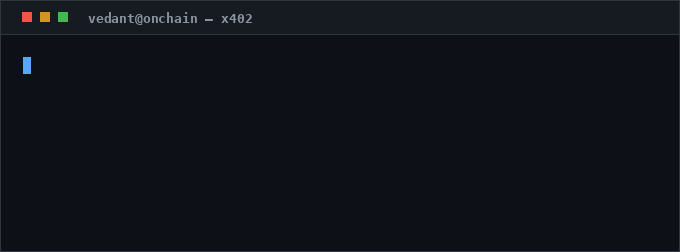

<h1 align="center">Hi 👋, I'm Vedant Anand</h1>

  

  Currently building DeFi options infrastructure at Timelock Protocol.

  
  
  
  
  

<!--
  This GIF is generated by assets/make-hero-gif.py and committed to the repo (CC0, see
  assets/LICENSE). It is referenced by relative path on purpose: the previous README
  hotlinked a GIF from a third-party site that later deleted it, which broke the profile.
-->

  

---

## What I work on

- **Agentic payments.** Building on [x402](https://github.com/coinbase/x402), a payment protocol that runs over plain HTTP, so software agents can pay for APIs without a human in the loop.
- **Stablecoin checkout.** Merchant-of-record flows with Bags, wiring storefronts to on-chain settlement.
- **DeFi options on Monad.** Concentrated-liquidity AMM contracts, an exercise/settlement engine, and the indexers that keep the frontend honest.
- **Verifiable documents.** Solidity contracts that anchor document provenance on-chain.

Based in Patiala, India, studying at Thapar University.

> [!NOTE]
> Most of my day-to-day work at Timelock (the CLAMM core, the Monad frontend, the Ponder indexers) lives in private repos. What's below is the public slice.

## Selected work

| Project | What it is |
| --- | --- |
| [AgentPay](https://github.com/VedantAnand17/AgentPay) | x402 payment rails for AI agents. Next.js app with `wagmi`/`viem`, settlement contracts in Foundry. |
| [sdk-sample](https://github.com/VedantAnand17/sdk-sample) | Next.js storefront on Bags' `@tbagtapp/sdk`, a merchant of record for stablecoin payments. |
| [Web3-Wallet](https://github.com/VedantAnand17/Web3-Wallet) | Browser wallet handling both Solana and EVM keys, via `@solana/web3.js` and `ethers`. |
| [Original-Docs-contracts](https://github.com/VedantAnand17/Original-Docs-contracts) | Foundry contract suite for on-chain document verification. |
| [SolanaFavorite](https://github.com/VedantAnand17/SolanaFavorite) | A Solana program written in Rust. |
| [portfolio-website](https://github.com/VedantAnand17/portfolio-website) | My site: Next.js, Tailwind, Radix. Live at [vedant-dev.com](https://vedant-dev.com). |

## Tech

Mostly **TypeScript** and **Solidity**. Next.js and Tailwind on the front end, **Foundry** for contracts,
**viem** and **wagmi** for chain access, **Ponder** for indexing, shipping to **Monad**, EVM L2s and **Solana**.

<!--
  style=for-the-badge is deliberate: square corners, and bold enough to read as a
  statement rather than metadata. Colours diverge from a few brand palettes on purpose --
  Next.js (#000) and Ethereum (#3C3C3D) ship as near-black and turn to mud against
  GitHub's #0d1117 dark canvas, so they use their accent blues instead.
  Note: shields' simple-icons set has no `linkedin` or `foundry` slug, so don't add one.
-->

  
  
  
  
  

  
  
  
  

  
  

## Stats

<!--
  These SVGs are committed to this repo by .github/workflows/profile-cards.yml (daily).
  Referencing them by relative path means the card keeps rendering even if the
  upstream stats service goes down, which is exactly how the previous README broke.
-->
<picture>
  <source media="(prefers-color-scheme: dark)" srcset="./profile/stats-dark.svg" />
  <source media="(prefers-color-scheme: light)" srcset="./profile/stats-light.svg" />
  
</picture>

<!--
  A top-languages card is also generated at ./profile/top-langs-{light,dark}.svg but is
  deliberately not shown: it weights by bytes of code, so committed build artifacts
  (an 8 MB vendored Python env in cloud-flask-asn, Solidity build output in
  UCScarbonTrading) dominate it and misrepresent the stack. To show it anyway:

  <picture>
    <source media="(prefers-color-scheme: dark)" srcset="./profile/top-langs-dark.svg" />
    <source media="(prefers-color-scheme: light)" srcset="./profile/top-langs-light.svg" />
    
  </picture>
-->

<!--
  Generated by .github/workflows/snake.yml into the `output` branch.
  These URLs 404 until that workflow has run at least once.
-->
<picture>
  <source media="(prefers-color-scheme: dark)" srcset="https://raw.githubusercontent.com/VedantAnand17/VedantAnand17/output/snake-dark.svg" />
  <source media="(prefers-color-scheme: light)" srcset="https://raw.githubusercontent.com/VedantAnand17/VedantAnand17/output/snake.svg" />
  
</picture>
